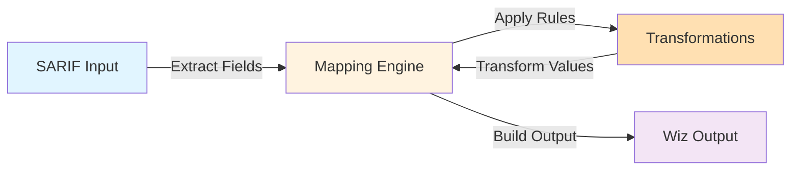
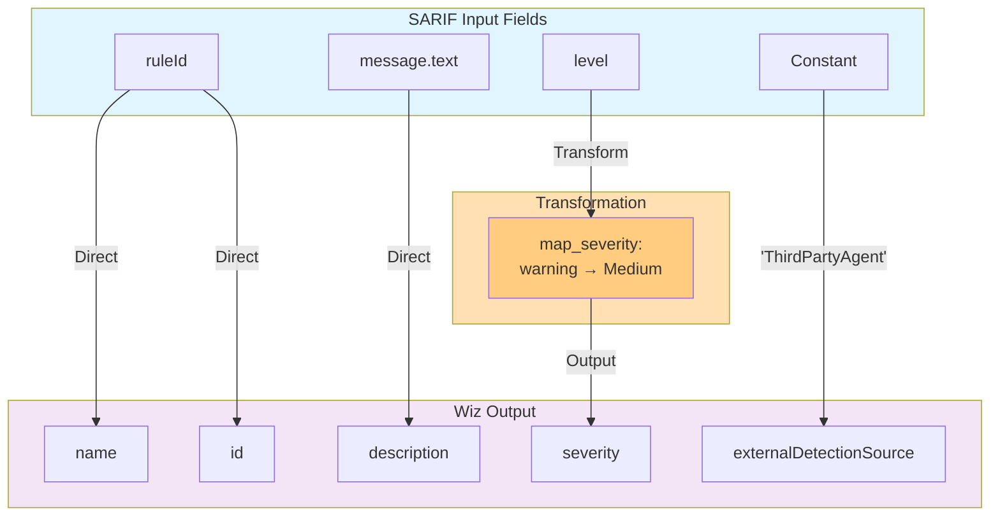
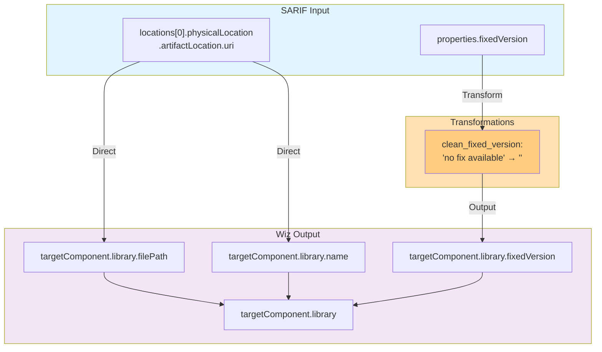
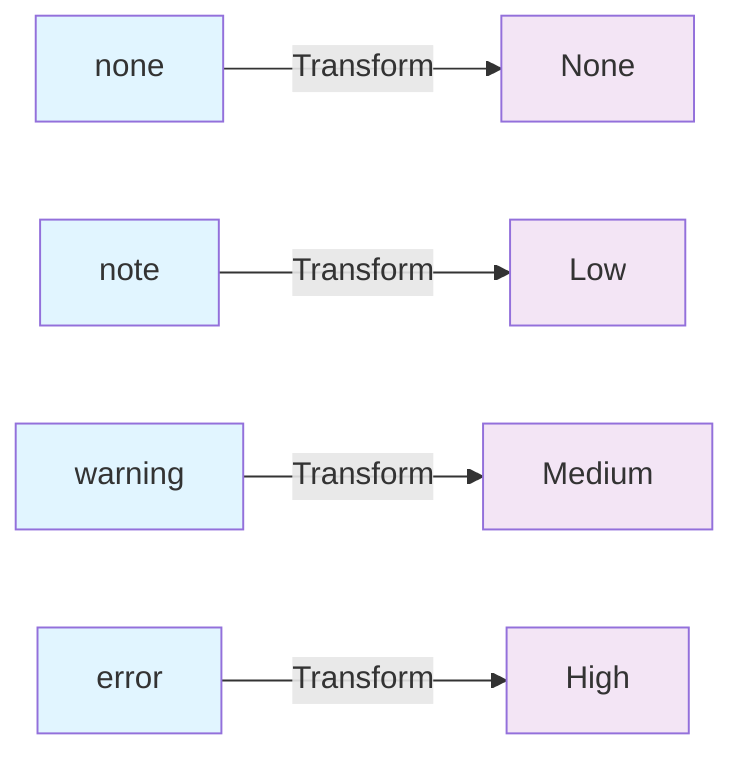
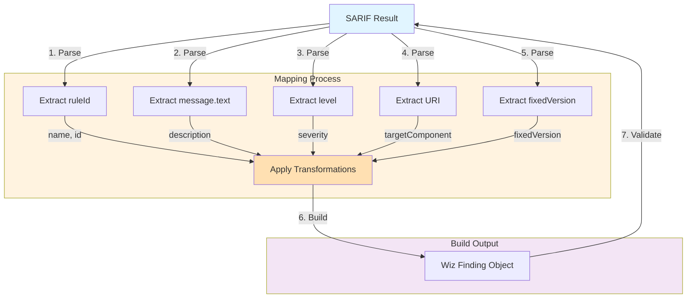

# SARIF to Wiz Field Mapping - Visual Reference

## Overview Diagram



---

## Finding Level Mappings



| Wiz Field | Source | SARIF Path | Transform | Enabled | Default |
|-----------|--------|-----------|-----------|---------|---------|
| `name` | SARIF | `ruleId` | - | ✅ | `unnamed-finding` |
| `description` | SARIF | `message.text` | - | ✅ | `""` |
| `severity` | SARIF | `level` | `map_severity` | ✅ | `Medium` |
| `id` | SARIF | `ruleId` | - | ✅ | - |
| `externalDetectionSource` | Constant | `ThirdPartyAgent` | - | ✅ | - |

---

## Target Component Mappings



| Wiz Field | Source | SARIF Path | Transform | Enabled |
|-----------|--------|-----------|-----------|---------|
| `targetComponent.library.filePath` | SARIF | `locations[0].physicalLocation.artifactLocation.uri` | - | ✅ |
| `targetComponent.library.name` | SARIF | `locations[0].physicalLocation.artifactLocation.uri` | - | ✅ |
| `targetComponent.library.fixedVersion` | SARIF | `properties.fixedVersion` | `clean_fixed_version` | ✅ |

---

## Optional Fields (Disabled by Default)

```mermaid
graph TD
    subgraph INPUT["SARIF Input"]
        C1["properties.fixedVersion"]
        C2["properties.cweId"]
        C3["properties.cvssScore"]
    end
    
    subgraph TRANSFORM["Transformations"]
        T3["format_remediation:<br/>'X' → 'Update to: X'"]
    end
    
    subgraph OUTPUT["Wiz Output (Disabled)"]
        O10["remediation"]
        O11["cweId"]
        O12["cvssScore"]
    end
    
    C1 -.->|Transform| T3
    T3 -.->|Disabled| O10
    C2 -.->|Disabled| O11
    C3 -.->|Disabled| O12
    
    style INPUT fill:#e1f5ff
    style TRANSFORM fill:#ffe0b2
    style OUTPUT fill:#ffebee
    style T3 fill:#ffcc80
    linkStyle 0,1,2,3,4 stroke:#999,stroke-dasharray: 5 5
```

| Wiz Field | Source | SARIF Path | Transform | Enabled |
|-----------|--------|-----------|-----------|---------|
| `remediation` | SARIF | `properties.fixedVersion` | `format_remediation` | ❌ |
| `cweId` | SARIF | `properties.cweId` | - | ❌ |
| `cvssScore` | SARIF | `properties.cvssScore` | - | ❌ |

---

## Transformations Reference

### 1. map_severity

Converts SARIF severity levels to Wiz severity levels:



| Input | Output |
|-------|--------|
| `none` | `None` |
| `note` | `Low` |
| `warning` | `Medium` |
| `error` | `High` |

### 2. clean_fixed_version

Cleans fixed version field:
- If value = `"no fix available"` → returns `""`
- Otherwise → returns value as-is

### 3. format_remediation

Formats fixed version into remediation guidance:
- Template: `"Update to version: {value}"`
- Example: `"2.6.7"` → `"Update to version: 2.6.7"`

---

## Complete Data Flow



---

## Usage in LucidChart

### Steps to Import:

1. **Copy the Mermaid code** from any diagram above
2. **In LucidChart:**
   - Create new document
   - Select "Insert" → "Media"
   - Choose "Mermaid" or use the Mermaid integration
   - Paste the diagram code
3. **Customize:**
   - Adjust colors and styling as needed
   - Add notes and annotations
   - Resize and position elements
   - Export as needed

### Alternative: Create Manually

Use the tables above as reference to create custom shapes:

- **Blue boxes** = SARIF Input
- **Orange boxes** = Transformations
- **Purple boxes** = Wiz Output
- **Dashed lines** = Disabled/Optional
- **Solid lines** = Enabled/Required

---

## Legend

| Symbol | Meaning |
|--------|---------|
| ✅ | Enabled by default |
| ❌ | Disabled by default |
| → | Direct mapping |
| -.-> | Optional/disabled mapping |
| Blue | SARIF input source |
| Orange | Transformation step |
| Purple | Wiz output field |

